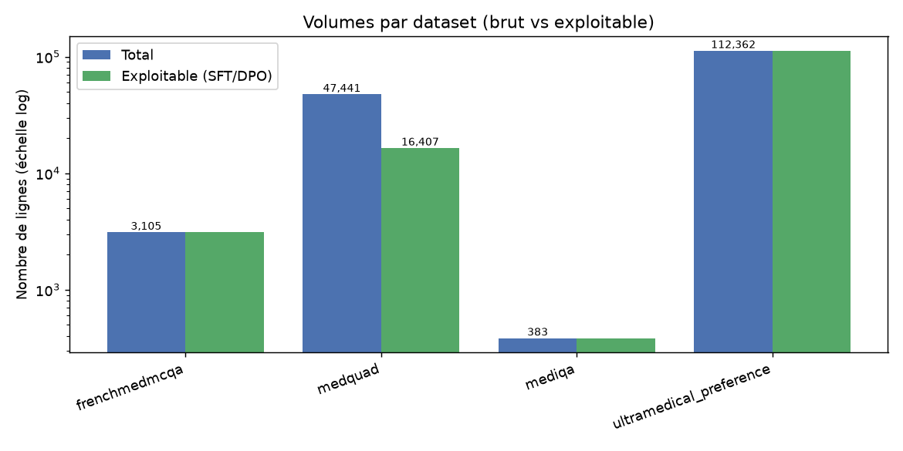
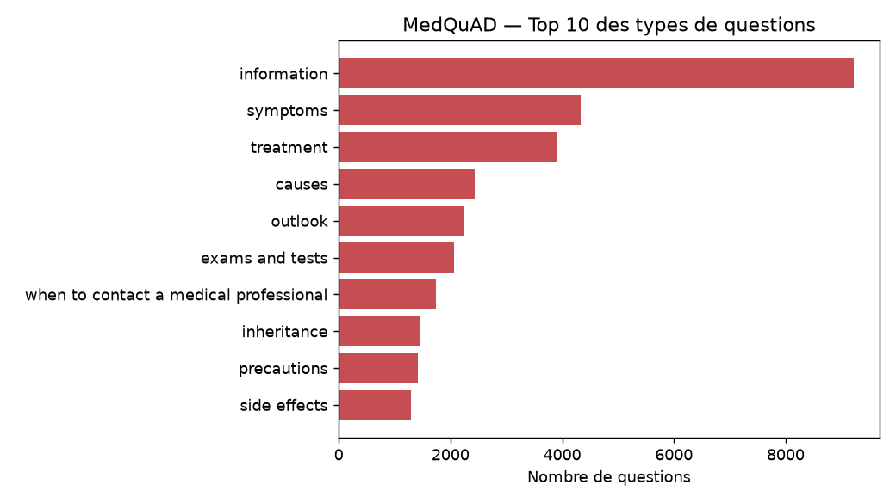

# Étape 1 — Analyse exploratoire des datasets

**Projet** : POC d'un agent IA de triage médical (CHSA) — fine-tuning Qwen3-1.7B (SFT + DPO)
**Date** : 2026-09-08
**Objectif** : comprendre le contenu des 4 corpus médicaux recommandés, leur qualité, et
définir la stratégie de préparation pour construire le dataset SFT (~5 000 paires) et le
jeu DPO, en conformité RGPD.

> Les résultats chiffrés de cette analyse sont produits par `scripts/run_eda.py` et
> sérialisés dans [`reports/eda_results.json`](./eda_results.json). Les données brutes
> (Parquet) sont dans `data/raw/` (ignoré par Git).

---

## 1. Vue d'ensemble des sources

| Corpus | Hub HF | Langue | Rôle | Volume (lignes) | Licence |
|---|---|---|---|---|---|
| FrenchMedMCQA | `qanastek/frenchmedmcqa` | FR | SFT | 3 105 (train 2 171 / val 312 / test 622) | Apache-2.0 |
| MedQuAD | `lavita/MedQuAD` | EN | SFT | 47 441 (train) — **16 407 exploitables** | à vérifier (données publiques NIH/NLM) |
| MediQA | `bigbio/mediqa_qa` | EN | SFT | 383 (train 208 / val 25 / test 150) | à vérifier (shared task ACL-BioNLP 2019) |
| UltraMedical-Preference | `TsinghuaC3I/UltraMedical-Preference` | EN | DPO | 112 362 (train 109 353 / val 2 232 / test 777) | MIT |



**Langue vérifiée par détection automatique** (échantillon de 400 lignes) :
- FrenchMedMCQA : **98,5 % français**
- MedQuAD : **97 % anglais**
- MediQA : **94,7 % anglais**
- UltraMedical-Preference : **99,75 % anglais**

Le corpus est donc clairement **bilingue FR/EN**, avec une seule source francophone
(FrenchMedMCQA) — point clé pour la faisabilité du 50/50 (voir §4).

---

## 2. Analyse détaillée par dataset

### 2.1 FrenchMedMCQA — QCM de pharmacie (FR)

**Nature** : 3 105 questions à choix multiples (A–E) issues des examens officiels du
diplôme de pharmacie français. C'est notre **unique source francophone**.

| Propriété | Valeur |
|---|---|
| Schéma | `id, question, answer_a..e, correct_answers[], subject_name, type, nbr_correct_answers` |
| Valeurs manquantes | aucune |
| Doublons (train) | 23 / 2 171 (2 148 uniques) |
| Longueur question | moyenne 99,6 caractères (max 491) |
| Longueur options | ~40–45 caractères |
| Sujet | 100 % « pharmacie » |

**Distribution du nombre de bonnes réponses** : 3 (33,1 %), 1 (27,4 %), 2 (24,3 %),
4 (13,6 %), 5 (1,6 %). **Type** : « multiple » 72,6 % / « simple » 27,4 %.

**Préparation pour le SFT** :
- Transformer chaque QCM en paire instruction→réponse. L'approche retenue (validée en
  amont) est la **transformation simple** : concaténer les bonnes options en une réponse
  fluide, sans génération synthétique par LLM.
- Exemple de mapping :
  - `user` : la question + les 5 options A–E ;
  - `assistant` : « Les réponses correctes sont : … ».
- Nettoyage : dédupliquer (23 lignes), normaliser la casse/typographie, conserver
  `correct_answers` et `nbr_correct_answers` dans les métadonnées (utile pour
  l'évaluation clinique).

### 2.2 MedQuAD — questions/réponses grand public (EN)

**Nature** : ≈47 k paires question/réponse extraites des sites NIH/NLM (GHR, GARD,
MedlinePlus, etc.), couvrant 37 types de questions (symptômes, traitements, causes…).

| Propriété | Valeur |
|---|---|
| Schéma | `document_id, document_source, document_url, category, umls_cui*, synonyms, question_id, question_focus, question_type, question, answer` |
| Valeurs manquantes | **answer : 31 034 (65,4 %)** ; `umls_cui` : 16 024 ; `synonyms` : 22 772 |
| Doublons (question) | 2 838 / 47 441 (44 603 uniques) |
| Longueur question | moyenne 51,5 caractères |
| Longueur réponse | moyenne 1 303 (médiane 890, **max 29 046**) |

**⚠️ Problème majeur de ce miroir `lavita/MedQuAD`** : les sources **ADAM (17 348),
MPlusDrugs (12 889) et MPlusHerbsSupplements (792)** ont une réponse **nulle**.
Seules les sources « maladies génétiques / instituts » sont complètes :

| Source | Lignes | Réponses non nulles |
|---|---|---|
| GHR | 5 430 | 5 430 ✅ |
| GARD | 5 394 | 5 389 |
| NIDDK | 1 192 | 1 192 |
| NINDS | 1 088 | 1 088 |
| MPlusHealthTopics | 981 | 981 |
| NIHSeniorHealth | 769 | 769 |
| CancerGov | 729 | 729 |
| NHLBI | 559 | 559 |
| CDC | 270 | 270 |
| **Total exploitable** | — | **16 407** |

**Types de questions dominants** : information (19,4 %), symptômes (9,1 %),
traitement (8,2 %), causes (5,1 %), pronostic (4,7 %), examens (4,3 %)…



**Préparation pour le SFT** :
1. **Filtrer** `answer` non nulle → **16 407 paires** (suffisant pour notre besoin de
   ~2 500 paires EN).
2. Dédupliquer sur `question`.
3. Nettoyer les rares balises HTML résiduelles (1 ligne) et tronquer/écarter les
   réponses anormalement longues (> 5 000 caractères) pour rester compatible avec la
   fenêtre de contexte de Qwen3-1.7B.
4. Mapping direct : `question` → `answer`, en conservant `question_type`, `question_focus`
   et `document_source` comme métadonnées.
5. **Alternative** : si l'on veut récupérer les 31 k réponses manquantes, repartir du
   MedQuAD original (GitHub `abachaa/MedQuAD`) ou d'un autre miroir complet — à
   investiguer seulement si le volume de 16 k s'avérait insuffisant (ce qui n'est pas le
   cas ici).

### 2.3 MediQA — QA clinique (EN) et choix du miroir

Deux variantes existent sur le Hub. **Comparaison** :

| Critère | `bigbio/mediqa_qa` (retenu) | `medalpaca/medical_meadow_mediqa` (rejeté) |
|---|---|---|
| Nature | Tâche officielle **MediQA 2019** (answer selection) | Dérivé « instruction-tuné » du même corpus |
| Volume | 383 lignes (train 208 / val 25 / test 150) | 2 208 lignes mais **154 questions uniques** |
| Structure | `question` + liste de réponses candidates | `instruction/input/output` avec ~14 candidats/question |
| Contexte (`input`) | vide (réponses déjà extraites) | **moyenne 6 405 caractères** (max 74 354) |
| Réponses | candidates, classées (ReferenceRank dans le config `source`) | résumés de candidats, **pas forcément la réponse gold** |
| Pertinence SFT | élevée après extraction de la réponse gold | faible (questions dupliquées, contexte énorme, outputs non-gold) |

**Décision** : conserver **`bigbio/mediqa_qa`** (config `mediqa_qa_bigbio_qa`), car c'est
la source canonique, propre et directement convertible en paire question→réponse.
`medalpaca/medical_meadow_mediqa` est écarté : 154 questions seulement, duplication
massive et « input » contextuel de ~6,4 Ko en moyenne (rédhibitoire pour un SFT sur un
modèle 1.7B).

**Point d'attention** : dans le config `bigbio_qa`, `answer` est une **liste de réponses
candidates** (2 à 11 par question) sans information de classement. Pour construire la
paire SFT, il faudra utiliser le config **`mediqa_qa_source`**, qui conserve
`ReferenceRank` (classement humain) et `ReferenceScore`, et retenir la réponse
`ReferenceRank == 1` comme réponse « gold ». → Prévoir ce téléchargement au moment de la
transformation.

**Rôle dans le projet** : complément mineur (383 questions). Le volume EN est porté par
MedQuAD ; MediQA apporte des questions « patient réel » utiles pour la robustesse.

### 2.4 UltraMedical-Preference — paires de préférences (EN, DPO)

**Nature** : 112 k paires `chosen` / `rejected` de réponses médicales, avec un
`feedback` (justification du classement) et des métadonnées de génération.

| Propriété | Valeur |
|---|---|
| Schéma | `prompt_id, label_type, prompt, chosen[], rejected[], metadata, feedback` |
| Splits | train 109 353 / validation 2 232 / test 777 |
| Valeurs manquantes | aucune |
| Doublons (prompt) | 32 829 / 109 353 (76 524 prompts uniques) |
| `label_type` | hard 41,9 % / length 37,6 % / easy 20,5 % |
| Rôles | `chosen` et `rejected` sont toujours en rôle `assistant` |
| Modèles `chosen` | gpt-4-1106-preview 54 %, Llama-3-70B 32 %, Llama-3-8B-UltraMedical 8 %… |
| Longueur `chosen` | moyenne 2 272 caractères (max 13 054) |
| Longueur `feedback` | moyenne 1 743 caractères |

**Préparation pour le DPO** :
1. Le format est déjà au standard `{"prompt", "chosen", "rejected"}` attendu par
   `trl.DPOTrainer` — transformation minimale (nettoyage + déduplication des prompts).
2. Nettoyer les **291 prompts** contenant des balises HTML résiduelles.
3. Dédupliquer sur `prompt` (32 829 doublons) en conservant une paire par prompt.
4. **Échantillonner** : le jeu complet (~76 k prompts uniques) est surdimensionné pour un
   POC 1.7B ; on visera un sous-ensemble (ex. 5 000–10 000 paires) équilibré sur
   `label_type` (hard/length/easy) et sur les modèles sources.
5. Conserver `feedback` comme métadonnée d'audit (justification clinique du classement).

---

## 3. Qualité des données et vigilance

- **Langue propre** : >94 % dans la langue attendue sur les 4 corpus ; quelques
  faux positifs du détecteur (phrases courtes/techniques) à ne pas sur-interpréter.
- **Balises HTML résiduelles** : rares (0 sur FrenchMedMCQA/MediQA, 1 sur MedQuAD,
  291 sur UltraMedical-Preference) — nettoyage prévu au pipeline.
- **Doublons** : présents partout (23 à 32 829 selon le corpus) — déduplication
  systématique sur la clé « question »/« prompt ».
- **Données personnelles (PII)** : ces corpus sont publics et théoriquement non
  nominatifs, mais le cahier des charges impose un passage systématique par **Presidio**
  (analyzer + anonymizer, modèle `fr_core_news_md`) avant toute persistance/versionnement
  — voir §6.

---

## 4. Faisabilité du dataset SFT ~5 000 paires (50/50 FR-EN)

**Contrainte** : une seule source francophone (FrenchMedMCQA, 3 105 questions).

| Langue | Source | Volume disponible | Volume après réserve d'évaluation |
|---|---|---|---|
| FR | FrenchMedMCQA | 3 105 | **2 483** (si test = 622 réservé à l'éval clinique) |
| EN | MedQuAD (exploitable) | 16 407 | très large |
| EN | MediQA | 383 | 383 |

**Verdict** : le **50/50 est réalisable**, mais FrenchMedMCQA est le facteur limitant —
les ~2 500 paires FR consomment **la quasi-totalité** de la source (train + validation).
Il ne reste donc **aucune marge FR** pour un jeu de validation interne dédié.

**Recommandation concrète** :
- **SFT** ≈ 5 000 paires : **2 400 FR** (FrenchMedMCQA train+val, après dédup) +
  **2 600 EN** (échantillon MedQuAD, éventuellement complété par MediQA).
- **Validation SFT** : prélever 10 % (~250 FR + ~250 EN) depuis le SFT, en stratifiant.
- **Jeu d'évaluation clinique isolé** (jamais vu en entraînement) :
  - FR : FrenchMedMCQA **test** (622 QCM) ;
  - EN : MediQA **test** (150) + un échantillon MedQuAD dédié (ex. 300) réservé dès le départ.
- **Option d'enrichissement FR (phase 2)** : traduire une portion de MedQuAD vers le
  français via un LLM local pour gonfler le volume FR et rééquilibrer — non nécessaire
  pour ce POC, à garder en tête.

---

## 5. Schéma de métadonnées proposé

Format cible **JSONL**, une entrée par ligne, au standard conversationnel :

```json
{
  "id": "sft_fr_000001",
  "lang": "fr",
  "source": "frenchmedmcqa",
  "role": "sft",
  "messages": [
    {"role": "user", "content": "Question… (A) … (B) … (C) …"},
    {"role": "assistant", "content": "Les réponses correctes sont : …"}
  ],
  "metadata": {
    "symptoms": [],
    "medical_history": [],
    "vital_signs": {},
    "topic": "pharmacologie",
    "question_type": "mcq",
    "source_id": "230bac…",
    "license": "apache-2.0",
    "confidence": null
  }
}
```

**Précisions importantes (honnêteté sur les données)** :
- Les champs `symptoms`, `medical_history`, `vital_signs` exigés par le sujet sont
  **rarement présents explicitement** dans ces corpus généralistes (QCM, QA encyclopédique).
  Ils seront renseignés par **extraction heuristique** (mot-clés, `question_type` MedQuAD)
  ou laissés `null` — on ne fabriquera pas d'annotations médicales non fiables.
- `source`, `source_id`, `license`, `lang` assurent l'**auditabilité** (traçabilité des
  transformations), exigée par le sujet.
- `confidence` : niveau de confiance de la réponse (ex. score `ReferenceScore` de MediQA),
  `null` par défaut.

---

## 6. Anonymisation et conformité RGPD (prochaine étape)

Bien que les corpus soient publics et non nominatifs, le sujet impose un pipeline
d'anonymisation systématique avant versionnement :

1. **AnalyzerEngine** (Presidio) avec modèle `fr_core_news_md` (français) + modèle EN ;
2. **AnonymizerEngine** avec stratégie `replace`/`mask` selon le champ ;
3. **Contrôle qualité** manuel sur un échantillon aléatoire (ex. 200 lignes) pour
   vérifier l'absence de PII résiduelle ;
4. **Journal d'audit** des entités détectées/masquées, documenté pour justifier la
   conformité RGPD.

Ce pipeline sera un script dédié (ex. `scripts/anonymize.py`) appliqué après la
standardisation JSONL.

---

## 7. Prochaines étapes

1. **Pipeline de transformation** (`src/triage_agent/data/build_dataset.py`) :
   standardisation des 4 corpus vers le schéma §5 (JSONL dans `data/processed/`).
2. **Anonymisation Presidio** + audit RGPD.
3. **Découpage** train/val/test + jeu d'évaluation clinique isolé (stratifié, seed fixe).
4. **Constitution du jeu DPO** : échantillonnage + nettoyage d'UltraMedical-Preference.
5. (Semaine 2) SFT LoRA sur Qwen3-1.7B.

---

## Annexe — Fichiers du dépôt

| Chemin | Rôle |
|---|---|
| `src/triage_agent/data/config.py` | Registre des sources (IDs, langue, rôle, licence) |
| `src/triage_agent/data/download.py` | Téléchargement vers `data/raw/` |
| `src/triage_agent/data/explore.py` | Fonctions EDA |
| `scripts/download_datasets.py` | CLI de téléchargement |
| `scripts/run_eda.py` | CLI EDA → `reports/eda_results.json` |
| `scripts/plot_eda.py` | Génération des figures |
| `data/` | Données (ignorées par Git) |
