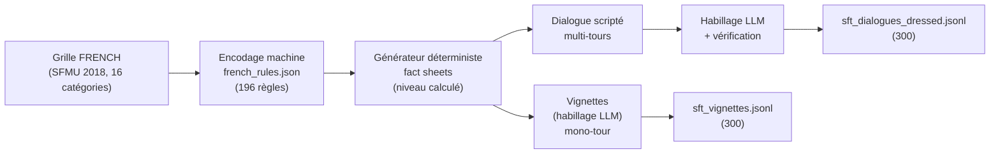
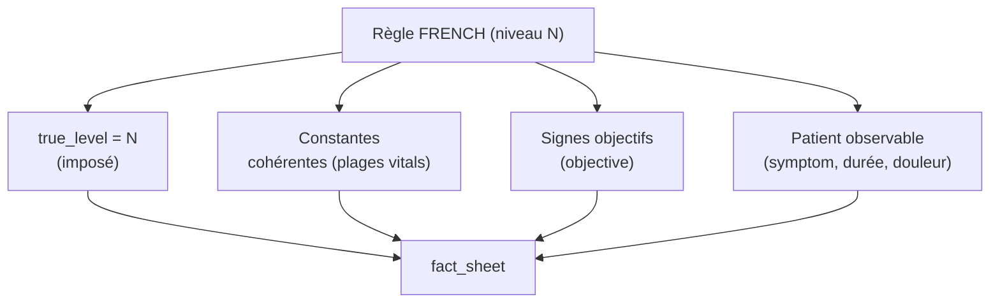
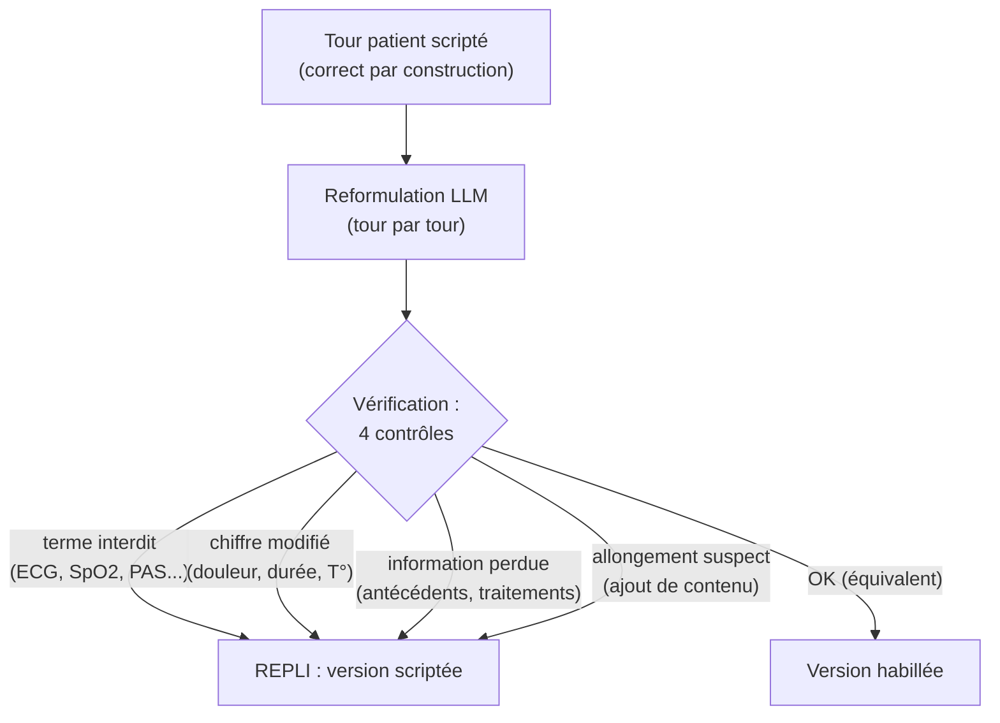

# Construction du dataset synthétique de triage médical (FRENCH)

**Objet** : rapport de construction du dataset de triage — vignettes + dialogues — utilisé
pour le SFT de l'agent.
**Date** : 2026-09-08
**Protocole** : FRENCH (SFMU 2018), 5 niveaux.

---

## 1. Objectif

Contexte confirmé (support OpenClassrooms) : les corpus de base (MedQuAD, FrenchMedMCQA,
MediQA, UltraMedical) ne contiennent **aucune annotation de triage**. La création d'un
corpus synthétique annoté selon un protocole reconnu **fait partie de l'évaluation**.

Objectif : produire ~600 exemples SFT de triage **corrects par construction**, couvrant
les 5 niveaux FRENCH et les 16 catégories de motifs de recours.

**Principe directeur** : le **niveau de triage est toujours calculé** (règle FRENCH),
jamais deviné par le LLM. Le LLM ne sert qu'à **habiller** en langage naturel.

---

## 2. Vue d'ensemble du pipeline



---

## 3. Phase 0 — Encodage de la grille FRENCH

La grille SFMU (9 pages) a été transcrite en données machine
(`src/triage_agent/data/french_rules.json`) :

| Élément | Valeur |
|---|---|
| Catégories | 16 |
| Motifs de recours | 99 |
| Règles (signes → niveau) | 196 |

**Schéma d'une règle** :

| Champ | Rôle |
|---|---|
| `level` | niveau FRENCH (1, 2, 3a, 3b, 4, 5) |
| `condition` | référence clinique FRENCH |
| `symptom` | **vécu patient** en langage naturel (ce qu'il peut dire) |
| `objective` | signes mesurés par l'infirmière (ECG, PAS…) |
| `vitals` | plages de valeurs pour générer des constantes cohérentes |
| `proxy` | question à poser au patient |
| `red_flag` | signe de gravité |

> **Décision clé** : séparer `symptom` (patient-reportable) de `objective` (mesuré),
> pour que le générateur ne puisse jamais faire dire au patient ce qu'il ne peut pas savoir.

---

## 4. Phase 1 — Générateur déterministe de fact sheets



La **fact sheet** est la vérité terrain (ce que saurait l'infirmière). Le niveau est
**correct par construction** : il est imposé par la règle échantillonnée, pas deviné.

**Échantillonnage équilibré** (`generate_balanced_fact_sheets`) : N fact sheets **par
niveau** (1→5), pour éviter le déséquilibre naturel de la grille (qui sur-représente le
niveau 3 et sous-représente le niveau 1).

---

## 5. Phase 2 — Vignettes (mono-tour)

La fact sheet est « habillée » par un LLM local (Gemma 4 26B, `Leila_fast:latest`) en
**message patient naturel**, puis appariée à la fiche déterministe.

```
[user]      « Bonjour... j'ai une douleur dans la poitrine qui serre... »
[assistant] [FICHE] {"priority": 2, "red_flags": ["suspicion SCA"], ...} [/FICHE]
            + explication patient
```

3 prompts systèmes testés → le prompt **« réaliste »** retenu (hésitations, langage
courant, inquiétude proportionnelle). Le niveau 1 (patient inconscient) est correctement
géré : le LLM formule le message depuis le point de vue d'un proche.

---

## 6. Phase 3 — Dialogues (multi-tours) + habillage + vérification

### 6.1 Dialogue scripté (déterministe)

Le patient ne révèle les faits **qu'au fil des questions** :

```
[patient]  Bonjour, je ne me sens pas bien...                ← ouverture vague
[agent]    <think>Accueil...</think> Qu'est-ce qui vous amène ?
[patient]  {symptom}                                          ← révélé
[agent]    <think>Motif, red flag, plage...</think> Depuis quand ?
[patient]  Depuis {duration}.
...
[agent]    <think>Niveau retenu...</think> [FICHE] + explication
```

Chaque tour agent contient un bloc `<think>` (auditabilité : pourquoi cette question,
quelle plage d'urgence), masqué au patient, conservé pour l'audit.

### 6.2 Habillage LLM + vérification anti-incohérence

Le scripté est **correct mais figé**. On l'habille avec le LLM, **sans jamais lui faire
confiance** :



**Les 4 contrôles d'équivalence** :

1. **Anti-fuite** : aucun terme non-observable (ECG, SpO₂, GCS, PAS, saturation…) ;
2. **Chiffres préservés** : les valeurs (7/10, 40 °C, 2 jours) inchangées ;
3. **Mots de contenu conservés** : maladies et médicaments toujours présents ;
4. **Longueur bornée** : pas d'ajout massif.

→ **Si un contrôle échoue, on garde le scripté** (correct par construction). Le pire cas
est « pas plus naturel », jamais « incorrect ».

> **Pourquoi c'est fiable** : le niveau étant déterministe à partir des faits,
> *préserver les faits = préserver le niveau*. La vérification est donc un contrôle
> d'équivalence, beaucoup plus simple que juger la justesse absolue.

---

## 7. Résultats chiffrés

| Jeu | Volume | Équilibre | Correct par construction |
|---|---|---|---|
| Vignettes (mono-tour) | 300 | 60 × 5 niveaux | ✅ |
| Dialogues (multi-tours) | 300 | 60 × 5 niveaux | ✅ |
| **Total** | **600** | | |

### Habillage des dialogues

| Résultat | Nombre | % |
|---|---|---|
| Réponses habillées | 676 | 91 % |
| Réponses conservées (repli) | 63 | 9 % |
| └ `information perdue` | 53 | |
| └ `chiffre modifié` | 10 | |

→ 91 % d'habillage réussi, 9 % d'incohérences **détectées et neutralisées** par la
vérification (53 pertes d'info, 10 changements de chiffres).

### Fuites (patient)

Aucune fuite réelle d'information non-observable dans les vignettes. Les mentions de
« glycémie » sont **légitimes** (un diabétique s'auto-mesure).

---

## 8. ⚠️ Biais linguistique détecté : le « Euh »

L'habillage introduit un **tick de langage systématique** :

| Mesure | Valeur |
|---|---|
| Occurrences de « euh » dans les dialogues habillés | 638 |
| Messages patients commençant par « Euh » | **607 / 1 039 (58,4 %)** |
| « euh » dans les vignettes (en milieu de phrase) | 55 (0,18/message) |
| « euh » dans les dialogues scriptés | 0 |

**Cause** : le prompt d'habillage demande des « hésitations », et le LLM (Gemma) sur-utilise
« Euh » en ouverture de chaque réponse.

**Conséquence** : ce biais est **côté patient** (messages `user`, lus par le modèle), pas
côté agent (messages `assistant`, que le modèle **génère**). Le modèle de triage produisant
le côté agent (0 « Euh »), il **n'imitera pas ce tic**. C'est de surcroît réaliste : les
patients hésitent souvent en s'exprimant. Impact résiduel négligeable (légère sur-représentation
statistique d'une amorce dans les entrées).

**Correctifs possibles** (pour la prochaine itération) :
1. supprimer/atténuer la mention « hésitations » dans le prompt ;
2. diversifier les ouvertures (exiger des amorces variées) ;
3. post-traitement : réécrire/retirer les « Euh » initiaux, ou les échantillonner à une
   fréquence réaliste (~10 %).

---

## 9. Points forts

1. **Niveau correct par construction** — jamais deviné par le LLM.
2. **Équilibre parfait** sur les 5 niveaux (60/60/60/60/60).
3. **Couverture large** : 16 catégories, 99 motifs, 196 règles.
4. **Habillage sûr** : vérification d'équivalence + repli automatique (9 % neutralisé).
5. **Traçabilité** : `case_id`, `true_level`, `source`, auditabilité via `<think>`.

## 10. Limites

1. **Biais « Euh » côté patient** (58,4 % des ouvertures) — sans impact sur la sortie du
   modèle (côté agent), mais à connaître.
2. Les dialogues habillés gardent une **structure figée** (ordre des questions fixe).
3. La fiche est **déterministe** (pas de variation dans le style de la fiche).
4. Pas encore de **paires DPO de triage** (chosen/rejected).

---

## 11. Prochaines étapes

1. **Générer les paires DPO de triage** (chosen = triage prudent, rejected = sous-triage).
2. **Évaluer** sur les jeux gold (Levine, Ramaswamy, IyàwóBench, psy).
3. **Fusionner** les 5 000 paires de base + les 600 triage → SFT LoRA (semaine 2).
