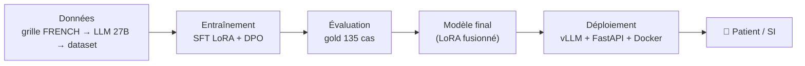
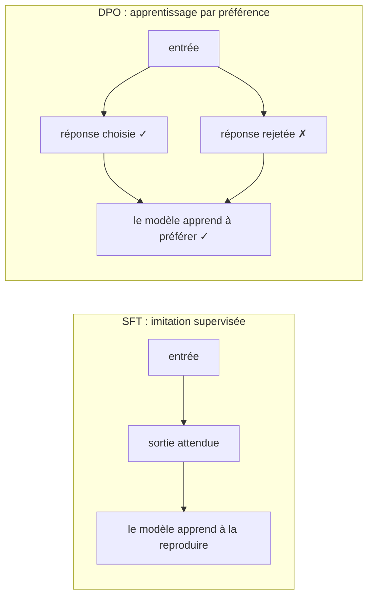
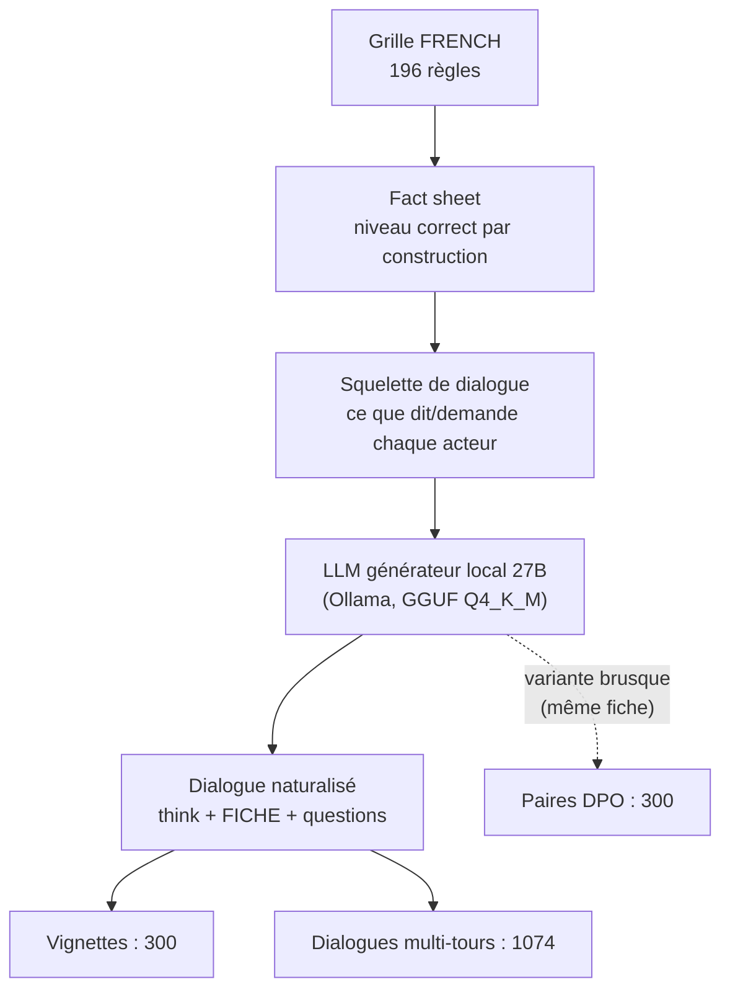
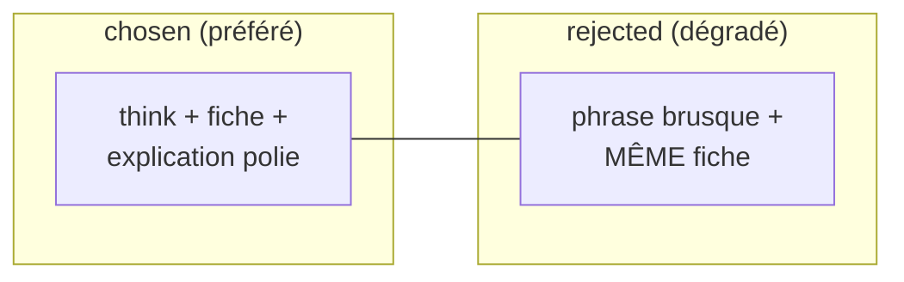
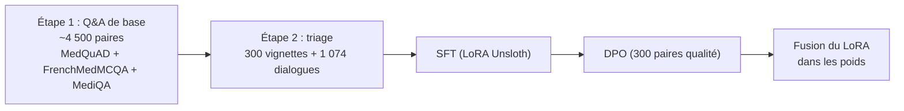
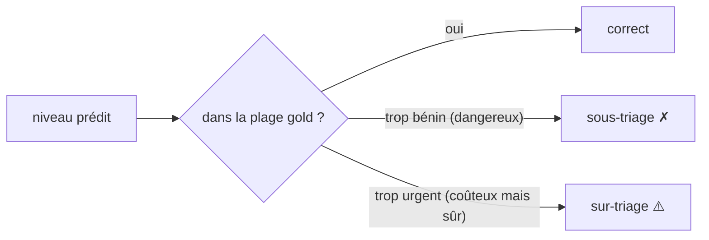
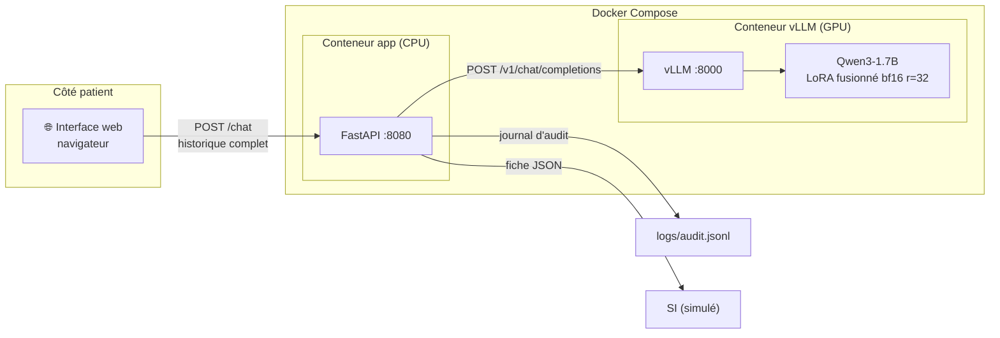
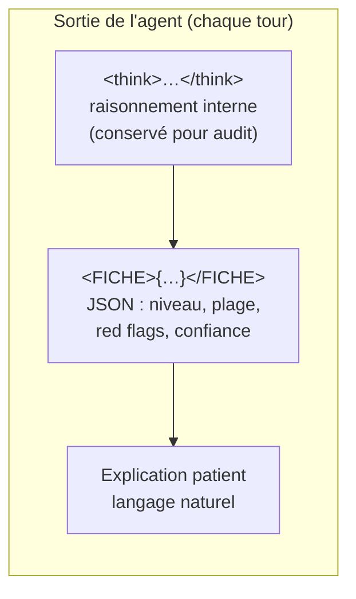
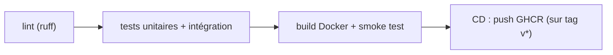

# 26 — Rapport final : agent IA de triage médical (POC CHSA)

**Date** : 2026-10 · **Statut** : 🖊️ brouillon v4 (à relire)
**Auteur** : Arnaud Pinsun · **Projet** : Projet 14 — POC d'agent de triage médical

---

## Résumé

POC d'un agent conversationnel de **triage médical** pour les urgences du CHSA, basé sur
**Qwen3-1.7B** affiné par **SFT (LoRA)** puis aligné par **DPO**. Faute de dataset de
triage public, le corpus d'entraînement a été **construit** à partir de la grille
**FRENCH** (SFMU, 5 niveaux) puis généré en langage naturel par un LLM 27B. Le modèle
final produit des fiches structurées **100 % bien formées**, atteint **68,9 % d'exactitude**
et **4,5 % de sous-triage** sur les cas urgents, et est déployé derrière
**vLLM + FastAPI + Docker** avec un pipeline **CI/CD**.

---

## Sommaire

1. Vue d'ensemble
2. Démarche et chronologie des itérations
3. Objectif et cahier des charges
4. Concepts fondamentaux (LoRA, QLoRA, rank, LR, epoch, steps, SFT, DPO)
5. La problématique des données
6. Le protocole FRENCH
7. Construction du dataset de triage
8. Entraînement
9. Évaluation
10. Déploiement
11. CI/CD
12. Performance, robustesse et traçabilité
13. Roadmap de déploiement et checklist « go / no-go »
14. Reproductibilité
15. Limites et points de vigilance
16. Conclusion
17. Ouverture : autres approches et améliorations
18. Références (rapports détaillés)

---

## 1. Vue d'ensemble



Le projet suit les 4 semaines du brief : **données** (semaine 1) → **SFT** (semaine 2) →
**DPO** (semaine 3) → **déploiement + CI/CD** (semaine 4).

> **Périmètre (à clarifier)** : je parle d'« agent de triage », mais le côté **agentique** est
> volontairement limité. Le LLM ne décide pas d'appeler des outils : il produit une **fiche
> structurée** (`<FICHE>`) pensée pour être **parsée et intégrée au SI** — le « tool call » est
> ici un simple format de sortie (du texte), pas un vrai appel d'outil déclenché par le modèle.

---

## 2. Démarche et chronologie des itérations

Le projet a avancé par **itérations** : chaque échec a produit un diagnostic qui a guidé la
suite. Voici la chronologie réelle, avec les impasses et les découvertes.

### Semaine 1 — Données

| Étape | Résultat |
|---|---|
| 4 corpus de base téléchargés, nettoyés, **anonymisés** (Presidio) | 0 PII réelle, jeux SFT/DPO/éval |
| Grille FRENCH encodée | 196 règles dans `french_rules.json` |
| Dataset synthétique initial | 300 vignettes + 300 dialogues |

### Semaine 2 — SFT

| Étape | Résultat / leçon |
|---|---|
| Baseline Qwen3-1.7B sur vLLM (zero-shot + **few-shot**) | **0/87** zero-shot (aucune fiche) ; **few-shot** : format appris mais valeurs fausses (repli sur le niveau 3, urgences sous-triées en 5) → le fine-tune est indispensable |
| SFT v1 (Q&A base + vignettes) | parse 95 %, exactitude 58 % — mais le **multi-tour interactif** est défaillant (fiche prématurée, boucles) |
| Dataset multi-tours (1 074 dialogues, 27B) + SFT v2 | parse 97,7 %, exactitude 60 %, **interactif corrigé** |

> *Note : les chiffres d'exactitude 58 % / 60 % sont mesurés sur le gold de l'époque
> (87 cas : Levine + Ramaswamy). La référence finale est le gold enrichi à 135 cas
> (+ 48 urgents IyàwóBench), sur lequel le modèle final atteint 68,9 % (section 9).*

### Semaine 3 — DPO et itérations

| Étape | Résultat / leçon |
|---|---|
| DPO « sous-triage » (3 tentatives) | **échec** : parse 0 %, format cassé → *le DPO ne peut pas enseigner un comportement nouveau (la prudence)* |
| Pivot : DPO « qualité de service » (même fiche, forme dégradée) | parse 100 % |
| Qwen3.5-4B (Instruct, bf16, all-linear) | parse 100 %, exactitude 69 %, sous-triage 3,4 % |
| Format « fiche à chaque tour » + patient naturalisé | 4B → 76,3 % ; 1.7B bloqué (parse 81 %) |

> **Rôle du 4B (diagnostic)** : quand le 1.7B plafonnait (parse 81 %, fiches malformées),
> le 4B a été entraîné avec **exactement la même méthode** et a atteint **100 % de parse**
> (ainsi que 76,3 % d'exactitude). Le format n'était donc pas en cause : la méthode était
> bonne, et c'est le 1.7B en QLoRA 4-bit qui produisait du JSON malformé. Le **modèle final
> retenu reste le 1.7B** (celui du brief), récupéré ensuite via bf16 + r=32.

### Découvertes décisives

Deux découvertes ont structuré la fin du projet (détail chiffré en section 8.3) :
le **QLoRA 4-bit** causait le JSON malformé (→ passage au bf16), et **`r=32`** aide le
petit modèle mais pas le gros. Par ailleurs, le **DPO** est neutre sur les métriques, et le
**non-déterminisme** est de ±2-3 pts.

### Semaine 4 — Déploiement

| Étape | Résultat |
|---|---|
| Fusion LoRA + vLLM + FastAPI + Docker + CI/CD | endpoint de démo accessible |
| Tests latence / robustesse / traçabilité | ~0,85 s/tour (RTX 3090), 28 tests verts |

---

## 3. Objectif et cahier des charges

À partir d'un LLM open-source (**Qwen3-1.7B**), produire un agent capable d'**accueillir
et d'évaluer les patients arrivant aux urgences** : poser des questions, évaluer un niveau
d'urgence, expliquer sa décision.

Contraintes du brief :
- **LoRA** (pas de full fine-tuning) ;
- **vLLM** pour l'inférence (pas Ollama) ;
- **dataset de triage à construire soi-même** (aucun dataset annoté n'est fourni) ;
- déploiement **FastAPI + Docker** et pipeline **CI/CD** ;
- tests de **latence**, de **robustesse** et **audits de traçabilité**.

---

## 4. Concepts fondamentaux

> Cette section rend le rapport autonome pour un lecteur non spécialiste du fine-tuning.

### 4.1 Fine-tuning, LoRA et QLoRA

**Le fine-tuning** consiste à reprendre un modèle pré-entraîné et à le ré-entraîner sur une
tâche cible. Deux façons de le faire :

```
Full fine-tuning (checkpoint complet)        LoRA (Low-Rank Adaptation)
────────────────────────────────────         ──────────────────────────────
W (d×d)  ──mise à jour──►  W' (d×d)          W (d×d)  GELÉ (jamais modifié)
tous les poids sont ré-entraînés             +  ΔW = A · B
d² paramètres entraînables                    A (d×r), B (r×d), avec r ≪ d
                                              2·d·r paramètres entraînables
```

- **Full fine-tuning** : on met à jour **tous** les poids (des milliards de paramètres).
  Il faut rétro-propager sur tout le réseau, beaucoup de VRAM, et on risque l'**oubli
  catastrophique** (perdre les connaissances de base). Chaque run produit un checkpoint
  complet (aussi gros que le modèle de base).
- **LoRA** : on **gèle** le modèle de base et on n'entraîne qu'un petit **adaptateur**
  (deux matrices de rang faible A et B). C'est rapide, économe en VRAM, et le modèle de
  base reste intact. L'adaptateur peut ensuite être **fusionné** dans les poids
  (`W + A·B`) pour que le modèle final ait la même taille que le modèle de base.
  → **C'est ce qu'impose le brief**, et c'est ce que j'ai fait.

**QLoRA (Quantized LoRA)** est une variante qui **quantifie le modèle de base en 4 bits**
(NF4) pour le faire tenir dans encore moins de VRAM :

```
QLoRA
─────
W (d×d)  en 4 bits (NF4)   ← base quantifiée, déquantifiée à la volée
  +  ΔW = A · B  (bf16)     ← adaptateur LoRA en pleine précision
```

Économie de VRAM importante, mais perte de précision. **Mon constat** (découverte clé du
projet) : sur le 1.7B, le QLoRA 4-bit a produit du **JSON malformé** (parse 81 %) ; en
passant au **bf16** (LoRA classique), le parse est remonté à **100 %**. Le QLoRA n'est donc
pas adapté à une tâche qui exige une sortie strictement structurée.

### 4.2 Rank, learning rate, epoch, step

**Rank `r`** : la dimension des matrices A (d×r) et B (r×d) de l'adaptateur LoRA.
`r` petit = adaptateur peu expressif (mais léger) ; `r` grand = plus de capacité (mais plus
de paramètres et risque de sur-apprentissage).

```
r = 16  →  2·d·16 paramètres par matrice
r = 32  →  2·d·32 paramètres par matrice
```

J'ai testé les deux : **r=32 a apporté +6 points d'exactitude au 1.7B** (63 % → 68,9 %),
mais **aucun gain au 4B** (76,3 % → 74,1 %, dans le bruit) — le petit modèle avait besoin
de plus de capacité, pas le gros.

**Learning rate (LR)** : le **pas** de mise à jour des poids (de combien on avance dans la
direction du gradient à chaque step). Trop grand → l'entraînement diverge ; trop petit →
convergence lente. J'ai utilisé **2e-4 pour le SFT** et **1e-6 pour le DPO** (le DPO
est bien plus sensible).

**Epoch** : un **passage complet** sur tout le jeu d'entraînement.

**Step** : une **mise à jour** des poids (un batch passé en avant puis en arrière).

```
steps = (n_exemples / batch_size) × epochs
exemple : 1 374 exemples de triage, batch 2, 4 epochs → ~2 748 steps
```

### 4.3 SFT et DPO



- **SFT (Supervised Fine-Tuning)** : on fournit des paires `(entrée → sortie attendue)`,
  le modèle apprend à les **imiter** (perte = prédiction du token suivant sur la sortie).
  C'est ce qui lui apprend le **comportement** de triage.
- **DPO (Direct Preference Optimization)** : on fournit des paires `(réponse choisie,
  réponse rejetée)`, le modèle apprend à **préférer** la première — directement, sans
  modèle de récompense séparé (contrairement au RLHF). La perte est :
  `−log σ(β · (log π_θ(chosen|x) − log π_θ(rejected|x)))`.
  C'est ce qui affine la **qualité de forme** (ton, politesse, explication).

---

## 5. La problématique des données

Aucun dataset public ne correspond directement au triage des urgences. Ce qui existe :

| Corpus | Nature | Limite pour mon usage |
|---|---|---|
| FrenchMedMCQA, MedQuAD, MediQA | QCM / Q&A médical | apporte des **connaissances**, pas le *comportement* de triage |
| UltraMedical-Preference | paires de dialogues avec réponse préférée | idéal pour la DPO **générique**, mais format EN sans fiche |
| Dialogues de triage (EN) | mono-tour, façon anglaise | ne colle ni au protocole FRENCH, ni au multi-tours |

→ Entraîner un LLM sur des QCM lui donne du vocabulaire médical et la structure d'un QCM,
mais **ne lui apprend pas à trier**. Il faut donc **construire le dataset**.

Ce qui rend la construction possible : le côté très **« programmable »** de l'échelle
d'urgence (le niveau se déduit d'une règle), que j'exploite pour générer des données
**correctes par construction**.

*(Les corpus de base ont par ailleurs été nettoyés et **anonymisés** (Presidio) en
semaine 1 — 0 donnée personnelle réelle, cf. rapports 02/03.)*

---

## 6. Le protocole FRENCH (SFMU)

Le triage repose sur la grille **FRENCH** (SFMU, mars 2018) : **5 niveaux** d'urgence,
**16 catégories** cliniques, **196 règles** encodées dans `french_rules.json`.

| Niveau | Situation | Délai médecin |
|---|---|---|
| 1 | Détresse vitale majeure | immédiat |
| 2 | Atteinte patente d'un organe / lésion sévère | < 20 min |
| 3a | Atteinte potentielle d'un organe / comorbidités lourdes | < 60 min |
| 3b | Atteinte fonctionnelle ou lésionnelle stable | < 90 min |
| 4 | Atteinte fonctionnelle/lésionnelle stable, acte limité | < 120 min |
| 5 | Pas d'atteinte évidente | < 240 min |

Trois décisions fondatrices ont guidé tout le projet. La première est que le niveau est
toujours **calculé** par la règle FRENCH, jamais **deviné** par le LLM : pendant la génération
des données, le niveau de vérité vient de la règle, et le LLM n'apprend que l'« habillage »
(les questions, l'explication, la fiche). La deuxième concerne l'incertitude : face à une
plage d'urgence `[borne_urgente, borne_bénigne]`, je retiens systématiquement la **borne
prudente**, et un red flag non écarté est traité comme présent. La troisième est que l'agent
ne s'appuie que sur du **patient-observable** — ce que le patient peut dire (symptômes,
intensité, durée, antécédents) — et jamais sur des constantes mesurées (PAS, SpO₂, ECG).

---

## 7. Construction du dataset de triage

### 7.1 Principe : du déterminisme au naturel



Je pars d'une **fiche clinique déterministe** (niveau *correct par construction*), j'en
déduis ce que le patient peut fournir et les questions à poser → un **squelette de
dialogue**. Un LLM local 27B transforme ce squelette en **dialogue réaliste**, en
produisant aussi la réflexion (`<think>`) et la fiche (`<FICHE>`).

### 7.2 Vignettes (mono-tour) — 300

Un cas complet → une évaluation immédiate. Elles apprennent le **format de sortie** :
raisonnement + fiche + explication au patient.

### 7.3 Dialogues multi-tours — 1074

Générés par le 27B à partir des squelettes (100 % corrects, ~85 % rédigés par le LLM,
~15 % de repli programmatique). Le patient ouvre par un **symptôme**, l'agent questionne
**une info à la fois** (motif, durée, intensité, antécédents, traitements) avant de conclure.

Décision importante : la fiche est produite **à chaque tour** (incomplète pendant le
questionnement, complète à la fin). C'est ce qui a rendu le comportement « questionner
puis conclure » apprenable, et qui a débloqué le DPO de questionnement.

### 7.4 Paires DPO « qualité de service » — 300



Principe : le `rejected` ne diffère du `chosen` que sur **la forme** (politesse,
explication) — **jamais sur le niveau**. La fiche est **identique** entre les deux
(150/150 finales + 150/150 questionnement), injectée programmatiquement. Le `rejected`
est rédigé par le 27B en mode « agent malpoli », avec garde-fous (pas de directive
médicale ni d'escalade).

### 7.5 Jeux d'évaluation (gold) — 135 cas externes

| Source | Cas | Type |
|---|---|---|
| Levine | 48 | multi-tours (EN → FR) |
| Ramaswamy | 39 | symptômes seuls |
| IyàwóBench | 48 | urgences immédiates (REFER_NOW) |
| **Total** | **135** | dont **66 urgents** |

Ces jeux sont **externes** (pas générés par moi) : ils valident que le modèle n'a pas
seulement appris à recopier le générateur.

---

## 8. Entraînement



### 8.1 SFT en 2 étapes

Le SFT s'est déroulé en deux temps. Une première étape sur ~4 500 paires de Q&A médicales
(MedQuAD, FrenchMedMCQA, MediQA) a apporté au modèle des connaissances médicales et une
capacité générale à suivre des instructions. Une seconde étape sur le dataset de triage
(300 vignettes + 1 074 dialogues) lui a ensuite appris le **comportement** de triage
proprement dit : le format de fiche, le questionnement et la prudence.

L'entraînement a été réalisé avec **Unsloth**, une bibliothèque qui accélère le fine-tuning
LoRA (environ 2× plus rapide et 50–70 % de VRAM en moins grâce à des noyaux optimisés, en
s'appuyant sur TRL/PEFT). Une fois le LoRA entraîné, l'adaptateur est **fusionné** dans les
poids du modèle de base, de sorte que le modèle final servi par vLLM ait exactement la même
taille que le modèle d'origine.

Paramètres retenus :

| Paramètre | 1.7B (final) | 4B (final) |
|---|---|---|
| Modèle de base | Qwen3-1.7B (Base) | Qwen3.5-4B (Instruct) |
| Précision LoRA | **bf16** (pas QLoRA 4-bit) | bf16 |
| Rank `r` | **32** | 16 |
| Target modules | attention + MLP | all-linear |
| Epochs | 4 | 4 |
| Learning rate | 2e-4 | 2e-4 |
| Batch (per device) | 2 | 2 |
| `max_seq_length` | 2048 | 2048 |
| Scheduler | cosine | cosine |

### 8.2 DPO

- Paires « qualité de service » (300), `beta 0.1`, LR 1e-6, LoRA r=16/32.
- **Première tentative abandonnée** : des paires « sous-triage » (fiche correcte vs fiche
  rétrogradée) et « question vs fiche » cassaient le format (parse 0 %) — le DPO ne peut
  pas enseigner un comportement nouveau, et UltraMedical (EN, sans fiche) diluait le format FR.

### 8.3 Hypothèses testées et découvertes clés

| Découverte | Détail |
|---|---|
| **QLoRA 4-bit = cause du JSON malformé** | 1.7B : parse 81 % en QLoRA → **100 % en bf16** (priorités hallucinées « 10/15 ») |
| **`r=32` aide le petit modèle, pas le gros** | 1.7B : 63 % → **68,9 %** (+6 pts) ; 4B : 76,3 % → 74,1 % (bruit) |
| **DPO neutre sur les métriques gold** | identique au SFT (l'effet est qualitatif : politesse/explication) |
| **Pas de troncature** | max 1 394 tokens < 2 048 |
| **Non-déterminisme ±2-3 pts** | sur 135 cas, un écart < 3 pts n'est pas significatif |

---

## 9. Évaluation

### 9.1 Métriques



Le **parse** mesure la part de sorties dont la fiche est un JSON valide — le prérequis à toute
exploitation. L'**exactitude** mesure la part de niveaux prédits qui tombent dans la plage
attendue. Le **sous-triage** compte les cas où le niveau prédit est trop bénin (l'erreur
dangereuse), pondéré par la distance à la plage, et le **sur-triage** les cas où il est trop
urgent (coûteux mais sans danger). Enfin, la **sécurité binaire** isole le sous-triage sur les
seuls cas urgents (niveau ≤ 3). La métrique principale pénalise le sous-triage bien plus
lourdement que le sur-triage, car rater une urgence est plus grave que surcharger le service.

### 9.2 Résultats finaux (gold 135 cas, seed 42)

**1.7B :**

| Config | Parse | Exactitude | Sous-triage | Binaire |
|---|---|---|---|---|
| QLoRA 4-bit r=16 | 81 % ❌ | 65,1 % | 6,4 % | — |
| bf16 r=16 | 100 % | 63 % | 5,9 % | 6,1 % |
| **bf16 r=32** | 100 % | **68,9 %** | **4,4 %** | **4,5 %** |
| bf16 r=32 + DPO | 100 % | 68,9 % | 4,4 % | 4,5 % |

**4B :**

| Config | Parse | Exactitude | Sous-triage | Binaire |
|---|---|---|---|---|
| bf16 r=16 SFT | 100 % | **76,3 %** | 5,9 % | 10,6 % |
| bf16 r=16 DPO | 100 % | 76,3 % | 5,9 % | 10,6 % |
| bf16 r=32 SFT | 100 % | 74,1 % | 6,7 % | 9,1 % |
| bf16 r=32 DPO | 100 % | 75,6 % | 5,9 % | 9,1 % |

> **Précision statistique** : le gold est restreint (135 cas, 66 urgents) et le modèle est
> non-déterministe (temp 0,6). Les métriques peuvent donc varier de **quelques points entre
> runs** (IC binaire ~±5,5 pts ; non-déterminisme ±2-3 pts). Un écart < 3 pts n'est pas
> significatif.

### 9.3 Matrice de confusion (binaire)

Lignes = vérité gold (urgent ≤ 3 / non-urgent > 3) ; colonnes = prédiction.

**1.7B (bf16 r=32) :**

| | prédit urgent | prédit non-urgent |
|---|---|---|
| **gold urgent** (66) | 63 | **3** (sous-triage) |
| **gold non-urgent** (69) | 19 (sur-triage) | 50 |

**4B (DPO v3) :**

| | prédit urgent | prédit non-urgent |
|---|---|---|
| **gold urgent** (66) | 59 | **7** (sous-triage) |
| **gold non-urgent** (69) | 15 (sur-triage) | 54 |

### 9.4 Résultats par source

| Source | 1.7B | 4B |
|---|---|---|
| Levine (48 multi-tours) | 41,7 % | 58,3 % |
| Ramaswamy (39 symptômes) | 64,1 % | 74,4 % |
| **IyàwóBench (48 urgents)** | **100 %** | 95,8 % |

### 9.5 Analyse

- Le **1.7B** (exigé par le brief) est **viable et sûr** : 3 sous-triages seulement sur 66
  urgents (4,5 %), **parfait sur IyàwóBench (100 %)** — il **sur-trie** davantage (19 cas).
- Le **4B** est **plus exact** (76,3 %) et sur-trie moins (15 cas), mais sous-trie plus
  (7 urgents ratés, 10,6 %).
- **Levine (multi-tours complexes) est le point faible des deux** (41,7 % / 58,3 %) :
  c'est le scénario le plus difficile — le questionnement multi-tours est imparfaitement appris.
- Le **DPO** n'apporte rien de mesurable sur le gold : son apport est qualitatif
  (ton plus poli/soigné), à évaluer par une revue humaine d'échantillons.

### 9.6 Choix du modèle final

Le **modèle final retenu est le 1.7B** (bf16 r=32 + DPO) : c'est celui du brief, et celui
sur lequel l'effort a été concentré. Le **4B** n'était pas une fin en soi : il a servi de
**diagnostic**. Quand le 1.7B plafonnait à 81 % de fiches bien formées, la question était de
savoir si le problème venait de la méthode ou du modèle ; le 4B, entraîné avec exactement la
même méthode, a atteint **100 % de parse** (et 76,3 % d'exactitude), ce qui a prouvé que la
méthode était bonne et que le 1.7B était simplement sous-capacité en QLoRA 4-bit. Une fois
corrigé (bf16 + r=32), le 1.7B est devenu viable (68,9 % d'exactitude). Le 4B resterait plus
abouti avec davantage de temps, mais il n'est pas le livrable.

---

## 10. Déploiement

### 10.1 Architecture



Deux conteneurs : **vLLM** (GPU, modèle fusionné en volume) et **FastAPI** (CPU, léger).
L'API est **stateless** : le client renvoie l'historique complet à chaque tour (une
conversation = un patient), et le serveur ne garde aucun état — seulement un **journal
d'audit** JSONL (traçabilité).

### 10.2 Format de sortie de l'agent



Ces trois blocs jouent des rôles distincts. Le `<think>` contient le raisonnement interne :
il est **destiné à être masqué au patient** et conservé pour l'audit — dans le POC actuel,
l'interface l'affiche sous la forme d'un bloc « thinking » pour faciliter le débug, mais
l'architecture le maintient séparé, prêt à être masqué en production. La `<FICHE>` est la
sortie structurée (JSON) que le SI est censé parser et intégrer. L'explication, enfin, est le
seul texte réellement montré au patient. L'API renvoie ces trois éléments séparément, plus un
flag `parse_ok` indiquant si la fiche est bien formée.

### 10.3 Docker

- `Dockerfile` : image FastAPI **légère** (uniquement les dépendances de serving, pas les
  deps d'entraînement : spacy/presidio/datasets…) ;
- `docker-compose.yml` : `vllm` (image officielle, GPU) + `app` ;
- `start.sh` / `stop.sh` : lancement/arrêt des conteneurs.

---

## 11. CI/CD (GitHub Actions)

Le pipeline ne teste que ce qui est **faisable sans GPU** (pas de re-training en CI) :



- **Tests** : 28 (parsing, fiche, audit, harness, robustesse, **API avec vLLM mocké**). Le
  client vLLM est injecté via une dépendance FastAPI → l'app est testable sans GPU ;
- **Smoke test** : l'image est construite et démarrée, `/health` répond ;
- **CD** : publication de l'image sur GHCR au push d'un tag `v*`.

---

## 12. Performance, robustesse et traçabilité

Mesures réalisées en conditions réalistes (vLLM, température 0,6, max_tokens 1 024), sur
**NVIDIA RTX 3090 (24 Go)**.

### 12.1 Latence

| Métrique | Valeur mesurée |
|---|---|
| TTFT (temps au 1er token) | ~0,01–0,02 s |
| Débit de génération | ~150–165 tok/s |
| Latence bout-en-bout (1 tour, fiche ~180 tokens) | ~0,85 s |
| Latence bout-en-bout (réponse courte) | ~0,11 s |

La latence est **pilotée par la longueur générée** (~163 tok/s), pas par la longueur de
l'historique : une réponse complète (~300-500 tokens) ≈ 2-3 s.

### 12.2 Concurrence

| Requêtes simultanées | Latence moyenne | p95 | Débit |
|---|---|---|---|
| 1 | 0,7 s | 0,7 s | 1,4 req/s |
| 2 | 0,84 s | 0,89 s | 2,2 req/s |
| 4 | 0,94 s | 1,15 s | 3,4 req/s |
| 8 | 2,7 s | 3,9 s | 1,8 req/s |

→ tient **jusqu'à ~4 patients simultanés** sans dégradation notable ; au-delà, le débit
partagé du GPU sature (latence moyenne ×3 à 8).

### 12.3 Robustesse

Tests dédiés (`tests/test_robustness.py`) : caractères unicode/spéciaux, message très
long (~40k chars), historique vide, **vLLM indisponible → 502 propre**, 20 requêtes
simultanées. Tous passent (28 tests au total).

### 12.4 Audit de traçabilité

Journal JSONL append-only (`scripts/audit_summary.py`). Exemple de résumé après un lot
de benchmark : **31 échanges, 17 conversations, 0 enregistrement incomplet** — chaque
échange est tracé (horodatage, `conversation_id`, messages, sortie brute, think, fiche,
`parse_ok`).

---

## 13. Roadmap de déploiement et checklist « go / no-go »

### Roadmap

1. **Environnement pilote (actuel)** : `docker compose` + `start.sh`, modèle local en volume.
2. **Pré-production** : publication HF (modèle + dataset), vLLM tire le modèle depuis HF,
   app publiée sur GHCR.
3. **Production conditionnelle** : GPU serveur (A100/L4), reverse-proxy/load balancer,
   monitoring (latence, file d'attente), sauvegarde de l'audit, scaling vLLM.

### Checklist « go / no-go » (avant mise en production)

| Critère | Seuil | Statut actuel |
|---|---|---|
| Parse (fiches bien formées) | ≥ 95 % | ✅ 100 % (gold) |
| Sous-triage binaire (urgents) | < 10 % | ✅ 4,5 % (1.7B) / ⚠️ 10,6 % (4B) |
| Latence p95 à charge cible | < 5 s | ✅ ~1–4 s (jusqu'à 4 simultanés) |
| Revue d'un clinicien (échantillon) | signée | ⏳ à faire |
| Conformité (audit + RGPD) | validée | ⏳ à faire |
| Calibration sur cas urgents | revue | ⏳ à faire |

---

## 14. Reproductibilité

**Environnement :**

| Élément | Valeur |
|---|---|
| Python | 3.12 (via `uv`) |
| Dépendances | poetry (`pyproject.toml`) |
| Entraînement | Unsloth, venvs `.venv-train` (1.7B) et `.venv-train-4b` (4B) |
| Inférence | vLLM 0.29.0, venv `.venv-vllm` |
| GPU | NVIDIA RTX 3090 (24 Go) |
| Génération de données | LLM 27B (Ollama, GGUF Q4_K_M) |

**Commandes clés :**

```bash
poetry run python scripts/validate_dataset.py     # conformité du dataset avant re-train
./scripts/train.sh                                 # SFT 1.7B
./scripts/train-4b.sh                              # SFT 4B
./scripts/train-dpo.sh / train-dpo-4b.sh           # DPO
poetry run python scripts/run_gold_eval.py         # évaluation sur le gold
./start.sh / ./stop.sh                             # déploiement Docker
poetry run python scripts/benchmark_latency.py     # benchmark de latence
```

---

## 15. Limites et points de vigilance

1. **Circularité synthétique** : le dataset de triage est généré par un LLM (27B) à partir
   de règles déterministes → risque « l'élève copie le maître ». Mitigé par le niveau
   *correct par construction* et la validation sur gold **externes**.
2. **Pas de clinicien dans la boucle** : la revue est humaine mais non médicale.
3. **Non-déterminisme** : ±2-3 pts sur 135 cas → les écarts < 3 pts ne sont pas significatifs.
4. **Mapping 4 niveaux → FRENCH 5** pour les gold externes : choix méthodologique à assumer.
5. **DPO neutre sur les métriques** : son apport (forme) n'est pas mesuré par le gold.
6. **Aucune constante objective** (PAS, SpO₂, ECG) : la fiche repose sur du patient-reportable
   uniquement — une vraie limite clinique.
7. **Binaire sécurité du 4B** (10,6 %) à surveiller sur le format « fiche à chaque tour ».
8. **Levine (multi-tours) mal maîtrisé** (41,7 % / 58,3 %) : le questionnement multi-tours
   reste le point faible à travailler.

---

## 16. Conclusion

Le POC démontre qu'un **Qwen3-1.7B fine-tuné** (SFT LoRA bf16 r=32 + DPO) — **le modèle
final retenu** — produit un agent de triage **exploitable** : format structuré 100 % fiable,
68,9 % d'exactitude, 4,5 % de sous-triage sur les cas urgents (100 % sur le jeu d'urgences
IyàwóBench). Le **4B**, utilisé comme diagnostic de la méthode, reste plus exact (76,3 %)
au prix d'un peu plus de sous-triage urgent.

---

## 17. Ouverture : autres approches et améliorations

Ce POC est une première itération. Plusieurs pistes permettraient de mieux répondre au
problème ; voici les plus structurantes.

**1. Sortir le calcul du niveau du LLM (le plus sûr).** Aujourd'hui le LLM produit lui-même
le niveau dans la fiche (appris par SFT). Une alternative plus robuste : le LLM ne ferait
que **conduire la discussion et remplir les champs factuels** de la fiche (motif, red flags,
intensité, durée…), et le **niveau serait calculé programmatiquement** à partir de la grille
FRENCH. Plus aucun risque d'erreur de niveau — le LLM ne serait que l'interface de collecte
d'information. C'est la décision « le niveau est calculé, jamais deviné » poussée jusqu'au bout.

**2. À mi-chemin : donner la règle au LLM (RAG).** Entre « le LLM décide seul » et « le LLM
ne décide rien », on peut **injecter au LLM la règle FRENCH pertinente** en contexte à
l'inférence (retrieval-augmented generation) : le modèle consulte la grille avant de remplir
la fiche. Ça réduit les erreurs de niveau sans abandonner la flexibilité du langage naturel,
et ancre le raisonnement dans la grille officielle.

**3. Des données réelles, relues par des cliniciens.** Mon dataset est synthétique
(généré par un 27B) : il souffre du « garbage in, garbage out ». Disposer de **vrais
dialogues de triage**, relus et validés par des experts, donnerait un meilleur dataset
d'entraînement **et** un meilleur jeu d'évaluation. C'est la piste qui apporterait le plus
de valeur clinique.

**4. Guider le raisonnement `<think>`.** Le contenu du `<think>` (faits, red flags, plage)
pourrait être contraint plus explicitement — par exemple en y imposant une liste de red
flags à écarter — pour **inciter le modèle à ne pas sous-trier** et rendre son raisonnement
plus auditable.

**5. Réduire le non-déterminisme.** Le gold étant petit, la variance de l'échantillonnage
est coûteuse. Un **vote majoritaire** (générer plusieurs réponses, retenir la plus
fréquente) ou un **ensemble** de modèles réduirait cette variance et stabiliserait les
métriques.

**6. Apprentissage par récompense (GRPO).** Le DPO a montré ses limites (neutre sur les
métriques). Un **GRPO avec récompense de sécurité** — récompenser `priority == niveau_vrai`,
pénaliser fortement `priority > niveau_vrai` (sous-triage) — serait plus adapté pour
renforcer la prudence qu'un DPO sur paires figées.

Perspectives immédiates : évaluer la qualité de forme du DPO par revue humaine, re-calibrer
le format sur les cas urgents, **renforcer le questionnement multi-tours** (point faible
Levine), intégrer la remontée de constantes objectives, et passer à une évaluation sur des
données cliniques réelles (avec un clinicien dans la boucle).

---

## 18. Références (rapports détaillés)

L'ensemble des étapes est documenté dans `reports/` (index : `reports/README.md`) :

| Rapport | Sujet |
|---|---|
| 01–03 | EDA, préparation, anonymisation des corpus |
| 04 | Protocole FRENCH (grille complète) |
| 05 | Plan d'attaque (stratégie globale) |
| 06–07 | Spec + construction du dataset de triage |
| 08 | Jeux gold + plan d'évaluation |
| 09–11 | vLLM : présentation, baseline, dépannage |
| 12–13 | Plan + résultats SFT (v1) |
| 14–16 | Dataset multi-tours 27B + SFT v2 |
| 17–18 | Plan + résultats Qwen3.5-4B |
| 19–21 | DPO (tentatives + qualité) + gold urgent |
| 22–23 | Format « fiche à chaque tour » + DPO v3 |
| 24–25 | Hypothèses (bf16/rank) + comparatif final |
