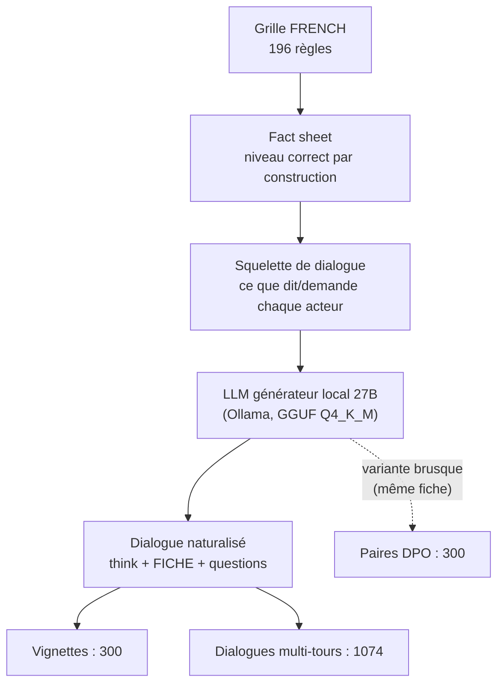
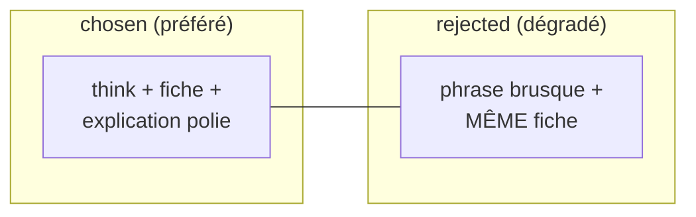
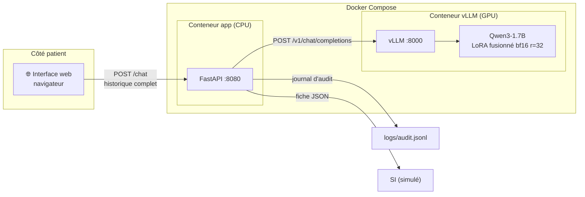
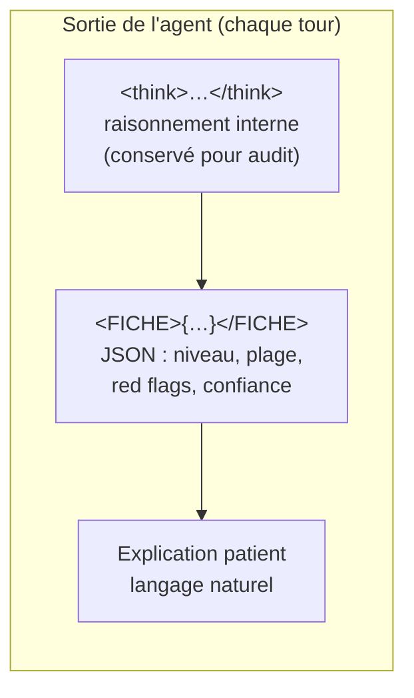
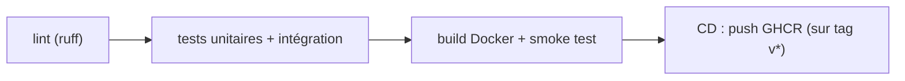

# 26 — Rapport final : agent IA de triage médical (POC CHSA)

**Date** : 2026-10 · **Statut** : 🖊️ brouillon v1 (à relire)

---

## 1. Résumé exécutif

POC d'un agent conversationnel de **triage médical** pour les urgences du CHSA, construit
en **fine-tunant Qwen3-1.7B** (SFT LoRA puis DPO), servi par **vLLM** derrière une API
**FastAPI** conteneurisée (Docker), avec un pipeline **CI/CD GitHub Actions**.

Le résultat clé : le modèle **1.7B** (exigé par le brief) est récupéré après un fix décisif
(passage du QLoRA 4-bit au **bf16**), et atteint sur le jeu d'évaluation externe :

| Modèle | Parse | Exactitude | Sous-triage | Binaire sécurité |
|---|---|---|---|---|
| **Qwen3-1.7B** (bf16, r=32) | **100 %** | 68,9 % | 4,4 % | **4,5 %** |
| Qwen3.5-4B (bf16, r=16) | 100 % | **76,3 %** | 5,9 % | 10,6 % |

Le 1.7B **sur-trie** davantage (sûr mais moins précis) ; le 4B est **plus exact** mais
sous-trie un peu plus sur les cas urgents. Le choix final dépend du critère retenu :
**sécurité** (1.7B) ou **exactitude** (4B).

---

## 2. Objectif et cahier des charges

À partir d'un LLM open-source (**Qwen3-1.7B**), produire un agent capable d'**accueillir
et d'évaluer les patients arrivant aux urgences** : poser des questions, évaluer un niveau
d'urgence, expliquer sa décision.

Contraintes du brief :
- **LoRA** (pas de full fine-tuning) ;
- **vLLM** pour l'inférence (pas Ollama) ;
- **dataset de triage à construire soi-même** (aucun dataset annoté n'est fourni) ;
- déploiement **FastAPI + Docker** et pipeline **CI/CD**.

---

## 3. La problématique des données

Aucun dataset public ne correspond directement au triage des urgences. Ce qui existe :

| Corpus | Nature | Limite pour notre usage |
|---|---|---|
| FrenchMedMCQA, MedQuAD, MediQA | QCM / Q&A médical | apporte des **connaissances**, pas le *comportement* de triage |
| UltraMedical-Preference | paires de dialogues avec réponse préférée | idéal pour la DPO **générique**, mais format EN sans fiche |
| Dialogues de triage (EN) | mono-tour, façon anglaise | ne colle ni au protocole FRENCH, ni au multi-tours |

→ Entraîner un LLM sur des QCM lui donne du vocabulaire médical et la structure d'un QCM,
mais **ne lui apprend pas à trier**. Il faut donc **construire le dataset**.

Ce qui rend la construction possible : le côté très **« programmable »** de l'échelle
d'urgence (le niveau se déduit d'une règle), qu'on exploite pour générer des données
**correctes par construction**.

---

## 4. Le protocole de triage : FRENCH (SFMU)

- **5 niveaux** d'urgence, de 1 (détresse vitale majeure) à 5 (non urgent) ;
- **16 catégories** cliniques, **196 règles** encodées (`french_rules.json`) ;
- délais médecin associés : immédiat / < 20 min / < 60 min / < 90 min / < 120 min / < 240 min.

Décisions fondatrices :
1. **Le niveau est toujours *calculé* par la règle, jamais *deviné* par le LLM.** Le LLM
   n'apprend que l'« habillage » (questions, explication, fiche) — le niveau de vérité
   vient de la règle FRENCH pendant la génération des données.
2. **Incertitude** : on retient la **borne prudente** d'une plage d'urgence
   `[borne_urgente, borne_bénigne]` ; un **red flag non écarté = présent**.
3. **Patient-observable uniquement** : le patient ne fournit que ce qu'il peut dire
   (symptômes, intensité, durée, antécédents) — jamais PAS / SpO₂ / ECG mesurés.

---

## 5. Construction du dataset de triage

### 5.1 Principe : du déterminisme au naturel

On part d'une **fiche clinique déterministe** (le niveau est *correct par construction*),
on en déduit ce que le patient peut fournir comme info et les questions à poser, ce qui
donne un **squelette de dialogue**. Un LLM local (27B) transforme ce squelette en
**dialogue réaliste**, en produisant aussi la réflexion (`<think>`) et la fiche (`<FICHE>`).

### 5.2 Vignettes (mono-tour) — 300

Un cas complet → une évaluation immédiate. Elles apprennent le **format de sortie** :
raisonnement + fiche + explication au patient.

### 5.3 Dialogues multi-tours — 1074

Générés par le 27B à partir des squelettes (100 % corrects, ~85 % rédigés par le LLM,
~15 % de repli programmatique). Le patient ouvre par un **symptôme**, l'agent questionne
**une info à la fois** (motif, durée, intensité, antécédents, traitements) avant de conclure.

Décision importante : la fiche est produite **à chaque tour** (incomplète pendant le
questionnement, complète à la fin). C'est ce qui a rendu le comportement « questionner
puis conclure » apprenable, et qui a débloqué le DPO de questionnement.

### 5.4 Paires DPO « qualité de service » — 300

Principe : le `rejected` ne diffère du `chosen` que sur **la forme** (politesse,
explication) — **jamais sur le niveau**. La fiche est **identique** entre les deux
(150/150 finales + 150/150 questionnement), injectée programmatiquement. Le `rejected`
est rédigé par le 27B en mode « agent malpoli », avec garde-fous (pas de directive
médicale ni d'escalade).

### 5.5 Jeux d'évaluation (gold) — 135 cas externes

| Source | Cas | Type |
|---|---|---|
| Levine | 48 | multi-tours (EN → FR) |
| Ramaswamy | 39 | symptômes seuls |
| IyàwóBench | 48 | urgences immédiates (REFER_NOW) |
| **Total** | **135** | dont **66 urgents** |

Ces jeux sont **externes** (pas générés par nous) : ils servent à valider que le modèle
n'a pas seulement appris à recopier le générateur.

---

## 6. Entraînement

### 6.1 SFT en 2 étapes

1. **Étape 1** : ~4 500 paires Q&A de base (MedQuAD + FrenchMedMCQA + MediQA) → connaissance
   médicale + suivi d'instructions.
2. **Étape 2** : dataset de triage (300 vignettes + 1 074 dialogues) → le **comportement**
   de triage.

Outil : **Unsloth** (LoRA), le LoRA final est **fusionné** dans les poids pour le serving vLLM.

Paramètres retenus :

| Paramètre | 1.7B (final) | 4B (final) |
|---|---|---|
| Modèle de base | Qwen3-1.7B (Base) | Qwen3.5-4B (Instruct) |
| Précision LoRA | **bf16** (pas QLoRA 4-bit) | bf16 |
| Rank `r` | **32** | 16 |
| Target modules | attention + MLP | all-linear |
| Epochs | 4 | 4 |
| Learning rate | 2e-4 | 2e-4 |
| Batch (per device) | 2 | 2 |
| `max_seq_length` | 2048 | 2048 |
| Scheduler | cosine | cosine |

### 6.2 DPO

- Paires « qualité de service » (300), `beta 0.1`, LR 1e-6, LoRA r=16/32.
- **Première tentative abandonnée** : des paires « sous-triage » (fiche correcte vs fiche
  rétrogradée) et « question vs fiche » cassaient le format (parse 0 %) — le DPO ne peut
  pas enseigner un comportement nouveau, et UltraMedical (EN, sans fiche) diluait le format FR.

### 6.3 Hypothèses testées et découvertes clés

| Découverte | Détail |
|---|---|
| **QLoRA 4-bit = cause du JSON malformé** | 1.7B : parse 81 % en QLoRA → **100 % en bf16** (priorités hallucinées « 10/15 ») |
| **`r=32` aide le petit modèle, pas le gros** | 1.7B : 63 % → **68,9 %** (+6 pts) ; 4B : 76,3 % → 74,1 % (bruit) |
| **DPO neutre sur les métriques gold** | identique au SFT (l'effet est qualitatif : politesse/explication) |
| **Pas de troncature** | max 1 394 tokens < 2 048 |
| **Non-déterminisme ±2-3 pts** | sur 135 cas, un écart < 3 pts n'est pas significatif |

---

## 7. Évaluation

### 7.1 Métriques

- **Parse** : % de sorties avec une fiche JSON valide ;
- **Exactitude** : % de niveaux prédits dans la plage gold ;
- **Sous-triage** : niveau prédit trop bénin (dangereux), **pondéré par la distance** ;
- **Sur-triage** : niveau prédit trop urgent (coûteux mais sûr) ;
- **Binaire sécurité** : taux de sous-triage sur les cas **urgents** (niveau ≤ 3).

La métrique principale pénalise le **sous-triage** bien plus que le sur-triage.

### 7.2 Résultats finaux (gold 135 cas, seed 42)

**1.7B :**

| Config | Parse | Exactitude | Sous-triage | Binaire |
|---|---|---|---|---|
| QLoRA 4-bit r=16 | 81 % ❌ | 65,1 % | 6,4 % | — |
| bf16 r=16 | 100 % | 63 % | 5,9 % | 6,1 % |
| **bf16 r=32** | 100 % | **68,9 %** | **4,4 %** | **4,5 %** |
| bf16 r=32 + DPO | 100 % | 68,9 % | 4,4 % | 4,5 % |

**4B :**

| Config | Parse | Exactitude | Sous-triage | Binaire |
|---|---|---|---|---|
| bf16 r=16 SFT | 100 % | **76,3 %** | 5,9 % | 10,6 % |
| bf16 r=16 DPO | 100 % | 76,3 % | 5,9 % | 10,6 % |
| bf16 r=32 | 100 % | 74,1 % | 6,7 % | 9,1 % |

### 7.3 Analyse

- Le **1.7B** (exigé par le brief) est **viable et sûr** (binaire 4,5 %, meilleur que le 4B
  sur ce critère), mais il **sur-trie** davantage (exactitude 68,9 %).
- Le **4B** est le **plus exact** (76,3 %) mais sous-trie un peu plus sur les urgents (10,6 %,
  non significatif vs 4,5 % au regard de la variance).
- Le **DPO** n'apporte rien de mesurable sur le gold : son apport est qualitatif
  (ton plus poli/soigné), qu'il faudrait évaluer par une revue humaine d'échantillons.

---

## 8. Déploiement

### 8.1 Architecture

Deux conteneurs : **vLLM** (GPU, modèle fusionné en volume) et **FastAPI** (CPU, léger).
L'API est **stateless** : le client renvoie l'historique complet à chaque tour (une
conversation = un patient), et le serveur ne garde aucun état — seulement un **journal
d'audit** JSONL (traçabilité).

### 8.2 Format de sortie de l'agent

- Le `<think>` (raisonnement) est **masqué au patient**, conservé pour l'audit ;
- La `<FICHE>` est la sortie structurée (JSON) destinée au SI ;
- L'explication est le seul texte montré au patient.

L'API renvoie ces trois éléments séparément, plus un flag `parse_ok` (fiche bien formée ou non).

### 8.3 Docker

- `Dockerfile` : image FastAPI **légère** (uniquement les dépendances de serving, pas les
  deps d'entraînement : spacy/presidio/datasets…) ;
- `docker-compose.yml` : `vllm` (image officielle, GPU) + `app` ;
- `start.sh` / `stop.sh` : lancement/arrêt des conteneurs.

---

## 9. CI/CD (GitHub Actions)

Le pipeline ne teste que ce qui est **faisable sans GPU** (pas de re-training en CI) :

- **Tests** : 23 (parsing, fiche, audit, harness, **API avec vLLM mocké**). Le client vLLM
  est injecté via une dépendance FastAPI → l'app est testable sans GPU ;
- **Smoke test** : l'image est construite et démarrée, `/health` répond ;
- **CD** : publication de l'image sur GHCR au push d'un tag `v*`.

---

## 10. Performance, robustesse et traçabilité

Mesures réalisées en conditions réalistes (vLLM, température 0,6, max_tokens 1 024), sur
**NVIDIA RTX 3090 (24 Go)**.

### 10.1 Latence

| Métrique | Valeur mesurée |
|---|---|
| TTFT (temps au 1er token) | ~0,01–0,02 s |
| Débit de génération | ~150–165 tok/s |
| Latence bout-en-bout (1 tour, fiche ~180 tokens) | ~0,85 s |
| Latence bout-en-bout (réponse courte) | ~0,11 s |

La latence est **pilotée par la longueur générée** (~163 tok/s), pas par la longueur de
l'historique : une réponse complète (~300-500 tokens) ≈ 2-3 s.

### 10.2 Concurrence

| Requêtes simultanées | Latence moyenne | p95 | Débit |
|---|---|---|---|
| 1 | 0,7 s | 0,7 s | 1,4 req/s |
| 2 | 0,84 s | 0,89 s | 2,2 req/s |
| 4 | 0,94 s | 1,15 s | 3,4 req/s |
| 8 | 2,7 s | 3,9 s | 1,8 req/s |

→ tient **jusqu'à ~4 patients simultanés** sans dégradation notable ; au-delà, le débit
partagé du GPU sature (latence moyenne ×3 à 8).

### 10.3 Robustesse

Tests dédiés (`tests/test_robustness.py`) : caractères unicode/spéciaux, message très
long (~40k chars), historique vide, **vLLM indisponible → 502 propre**, 20 requêtes
simultanées. Tous passent (28 tests au total).

### 10.4 Audit de traçabilité

Journal JSONL append-only (`scripts/audit_summary.py`). Exemple de résumé après un lot
de benchmark : **31 échanges, 17 conversations, 0 enregistrement incomplet** — chaque
échange est tracé (horodatage, `conversation_id`, messages, sortie brute, think, fiche,
`parse_ok`).

## 11. Roadmap de déploiement et checklist « go / no-go »

### Roadmap

1. **Environnement pilote (actuel)** : `docker compose` + `start.sh`, modèle local en volume.
2. **Pré-production** : publication HF (modèle + dataset), vLLM tire le modèle depuis HF,
   app publiée sur GHCR.
3. **Production conditionnelle** : GPU serveur (A100/L4), reverse-proxy/load balancer,
   monitoring (latence, file d'attente), sauvegarde de l'audit, scaling vLLM.

### Checklist « go / no-go » (avant mise en production)

| Critère | Seuil | Statut actuel |
|---|---|---|
| Parse (fiches bien formées) | ≥ 95 % | ✅ 100 % (gold) |
| Sous-triage binaire (urgents) | < 10 % | ✅ 4,5 % (1.7B) / ⚠️ 10,6 % (4B) |
| Latence p95 à charge cible | < 5 s | ✅ ~1–4 s (jusqu'à 4 simultanés) |
| Revue d'un clinicien (échantillon) | signée | ⏳ à faire |
| Conformité (audit + RGPD) | validée | ⏳ à faire |
| Calibration sur cas urgents | revue | ⏳ à faire |

## 12. Limites et points de vigilance (à dire franchement)

1. **Circularité synthétique** : le dataset de triage est généré par un LLM (27B) à partir
   de règles déterministes → risque « l'élève copie le maître ». Mitigé par le niveau
   *correct par construction* et la validation sur gold **externes**.
2. **Pas de clinicien dans la boucle** : la revue est humaine mais non médicale.
3. **Non-déterminisme** : ±2-3 pts sur 135 cas → les écarts < 3 pts ne sont pas significatifs.
4. **Mapping 4 niveaux → FRENCH 5** pour les gold externes : choix méthodologique à assumer.
5. **DPO neutre sur les métriques** : son apport (forme) n'est pas mesuré par le gold.
6. **Aucune constante objective** (PAS, SpO₂, ECG) : la fiche repose sur du patient-reportable
   uniquement — une vraie limite clinique.
7. **Binaire sécurité du 4B** (10,6 %) à surveiller sur le format « fiche à chaque tour ».

---

## 13. Conclusion et perspectives

Le POC démontre qu'un **Qwen3-1.7B fine-tuné** (SFT LoRA bf16 r=32 + DPO) produit un agent
de triage **exploitable** : format structuré 100 % fiable, 68,9 % d'exactitude, 4,5 % de
sous-triage sur les cas urgents. Le **4B** reste plus exact (76,3 %) au prix d'un peu plus
de sous-triage urgent.

Perspectives : évaluer la qualité de forme du DPO par revue humaine, re-calibrer le
format sur les cas urgents, intégrer la remontée de constantes objectives (si un dispositif
médical les fournit), et passer à une évaluation sur des données cliniques réelles
(avec l'accord d'un établissement et un clinicien dans la boucle).
